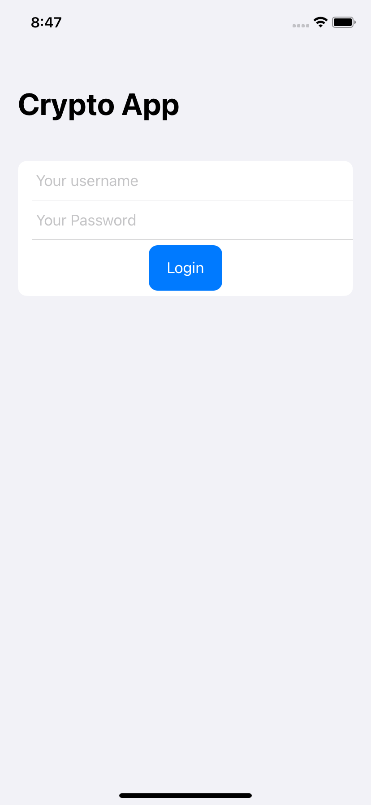
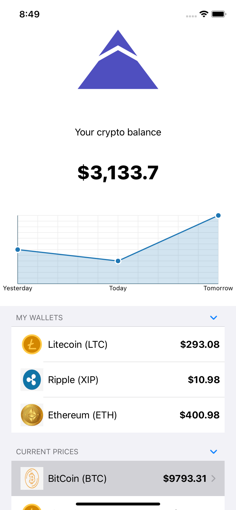
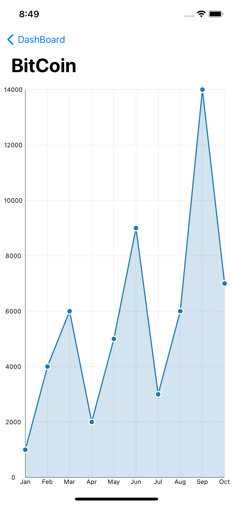

# Crypto Project

>A demo crytpo project in the SwiftUI with clean architecture.


## ***PREVIEW***

| LOGIN PAGE | HOME PAGE |DETAILS PAGE |
|     ------------- | ------------- | ------------- |
| | ||


API ENDPOINT CODE IN PHP
====================
```
<?php

//an array to display response
$response = array();

if(isset($_POST['username']) && isset($_POST['password']))
{
    //getting values 
    $username = $_POST['username'];
    $password = $_POST['password'];

        if ($username == "admin" && $password == "admin") {
            $response['message'] = "ok";
            echo json_encode($response);
        } 
        else {
            $response['message'] = "no";
            echo json_encode($response);
        }
} 

else {
    $result = array(
        'errorCode' => 406,
        'error' => 'Error! Insufficient parameters'
    );

    echo json_encode($result);
}

?>
```